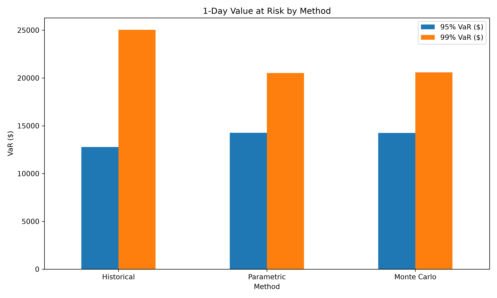
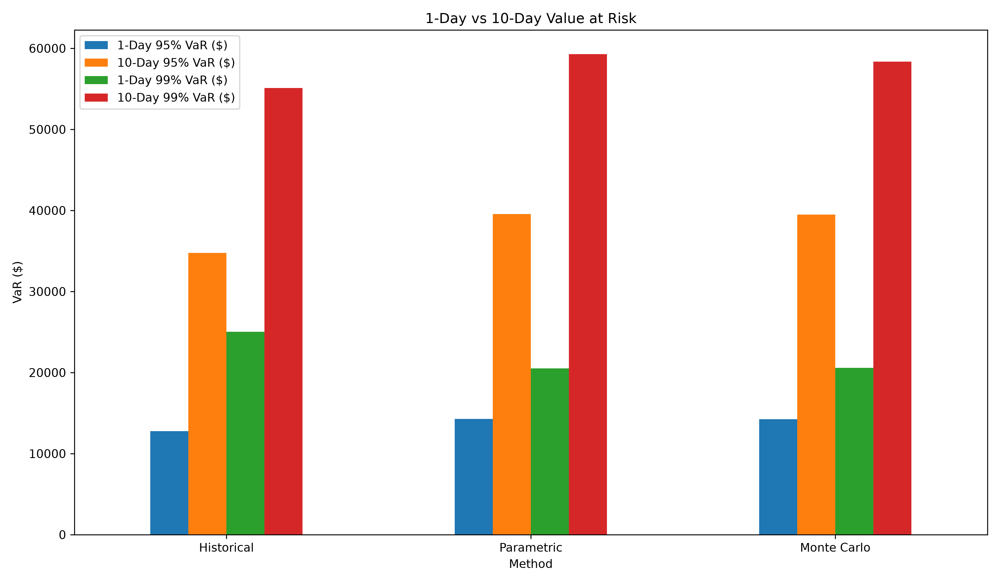
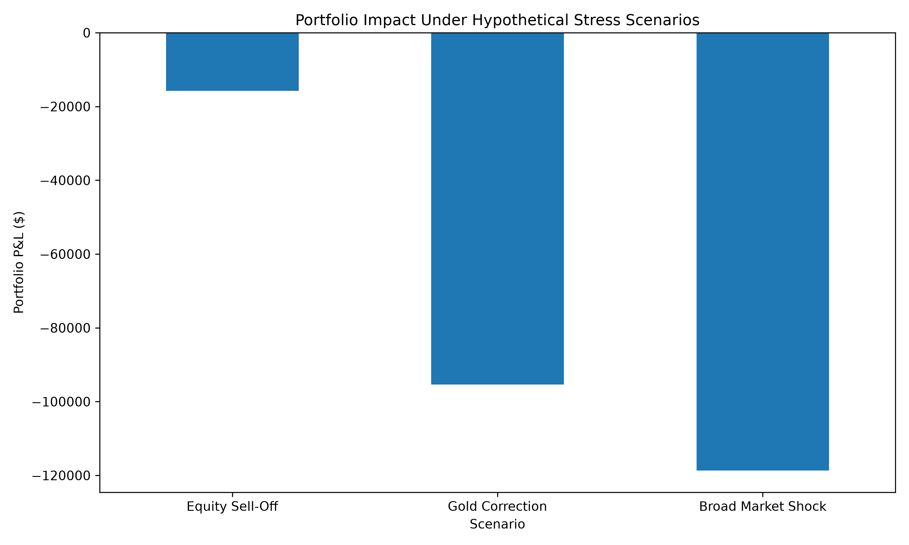
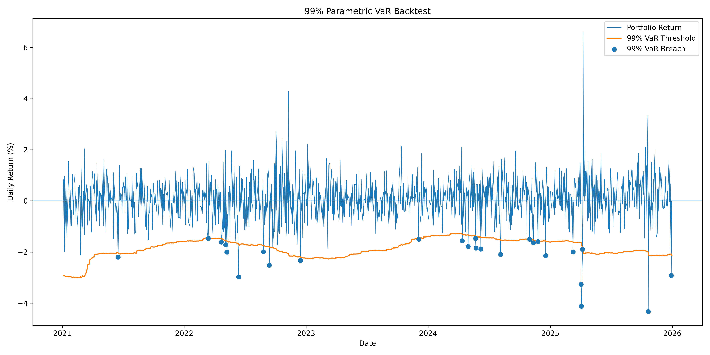

# Portfolio Value at Risk & Stress Testing

## Overview

This project evaluates the market risk of a $1,000,000 multi-asset portfolio using Value at Risk (VaR), Expected Shortfall, Monte Carlo simulation, stress testing, and VaR backtesting.

The analysis extends a previously optimized portfolio consisting of:

- AAPL
- GLD
- JNJ
- JPM
- XOM

Historical market data from January 2020 through December 2025 was obtained using `yfinance`.

The project focuses on measuring potential portfolio losses under normal market conditions, extreme historical events, and hypothetical stress scenarios.

---

## Portfolio

Approximate portfolio weights:

| Asset | Weight |
|---|---:|
| AAPL | 19.75% |
| GLD | 64.47% |
| JNJ | 0.00% |
| JPM | 13.05% |
| XOM | 2.72% |

Portfolio value:

**$1,000,000**

---

## Methodology

### 1. Daily Portfolio Returns

Daily asset returns were calculated using:

\[
R_t = \frac{P_t}{P_{t-1}} - 1
\]

Portfolio returns were calculated as the weighted sum of individual asset returns:

\[
R_p = \sum_{i=1}^{n} w_iR_i
\]

Daily portfolio P&L was then calculated as:

\[
P\&L_t = R_{p,t} \times Portfolio\ Value
\]

---

## 2. Historical Value at Risk

Historical VaR uses the empirical distribution of observed portfolio returns.

The 95% VaR corresponds to the 5th percentile of historical returns, while the 99% VaR corresponds to the 1st percentile.

### 1-Day Historical VaR

| Confidence Level | VaR Return | VaR |
|---|---:|---:|
| 95% | -1.2775% | $12,775 |
| 99% | -2.5032% | $25,032 |

---

## 3. Expected Shortfall

Expected Shortfall measures the average loss conditional on losses exceeding the VaR threshold.

\[
ES_{\alpha}
=
-E[R_p \mid R_p \le VaR_{\alpha}]
\]

| Confidence Level | ES Return | Expected Shortfall |
|---|---:|---:|
| 95% | -2.0488% | $20,488 |
| 99% | -3.4533% | $34,533 |

Expected Shortfall is substantially larger than VaR, demonstrating that losses can increase significantly once the portfolio enters the extreme tail of the return distribution.

---

## 4. Parametric Value at Risk

Parametric VaR assumes portfolio returns follow a normal distribution.

\[
VaR_{\alpha}
=
\mu + z_{\alpha}\sigma
\]

The portfolio's historical daily statistics were:

- Mean daily return: **0.0812%**
- Daily volatility: **0.9165%**

### Parametric VaR

| Confidence Level | VaR Return | VaR |
|---|---:|---:|
| 95% | -1.4263% | $14,263 |
| 99% | -2.0509% | $20,509 |

---

## 5. Monte Carlo Value at Risk

100,000 portfolio returns were simulated using the historical portfolio mean and volatility.

A fixed random seed was used to ensure reproducibility.

| Confidence Level | VaR Return | VaR |
|---|---:|---:|
| 95% | -1.4250% | $14,250 |
| 99% | -2.0585% | $20,585 |

Parametric and Monte Carlo VaR estimates were very similar because both methods used a normal-return assumption.



---

## 6. Comparison of VaR Methods

| Method | 95% VaR | 99% VaR |
|---|---:|---:|
| Historical | $12,775 | $25,032 |
| Parametric | $14,263 | $20,509 |
| Monte Carlo | $14,250 | $20,585 |

Historical VaR was lower than the normal-based methods at the 95% confidence level but substantially higher at 99%.

This suggests that extreme historical portfolio losses were more severe than implied by the normal distribution assumption.

---

## 7. 10-Day Value at Risk

Risk was also evaluated over a 10-trading-day holding period.

Historical 10-day returns were calculated by compounding rolling daily returns:

\[
R_{10}
=
\prod_{t=1}^{10}(1+R_t)-1
\]

For the parametric model:

\[
\mu_{10}=10\mu
\]

\[
\sigma_{10}=\sqrt{10}\sigma
\]

### 10-Day VaR

| Method | 95% VaR | 99% VaR |
|---|---:|---:|
| Historical | $34,757 | $55,100 |
| Parametric | $39,550 | $59,302 |
| Monte Carlo | $39,499 | $58,346 |



The longer holding period substantially increased potential portfolio losses.

---

## 8. Historical Stress Testing

The portfolio's worst historical trading days and rolling 10-day periods were examined.

### Worst Single Trading Day

The worst daily portfolio return occurred on 12 March 2020:

- Portfolio return: **-5.91%**
- Portfolio loss: **$59,087**

This loss was substantially larger than the 1-day 99% Historical VaR of approximately $25,032.

### Worst Rolling 10-Day Period

The most severe 10-day period ended on 19 March 2020:

- 10-day return: **-14.72%**
- Portfolio loss: **$147,234**

The worst realized 10-day loss was approximately 2.7 times the 10-day 99% Historical VaR.

This demonstrates that VaR represents a loss threshold rather than a maximum possible loss.

---

## 9. Hypothetical Stress Testing

Three illustrative stress scenarios were constructed.

These scenarios are hypothetical and are not forecasts.

| Scenario | Portfolio Return | Portfolio P&L |
|---|---:|---:|
| Equity Sell-Off | -1.58% | -$15,770 |
| Gold Correction | -9.54% | -$95,396 |
| Broad Market Shock | -11.86% | -$118,646 |



The Equity Sell-Off produced a relatively limited portfolio loss because the assumed increase in GLD partially offset losses in equities.

The Gold Correction produced a much larger loss because GLD represented the largest portfolio allocation.

The Broad Market Shock generated the largest hypothetical loss because multiple portfolio assets declined simultaneously.

---

## 10. Stress Contribution Analysis

Asset-level contributions were calculated as:

\[
Contribution_i = w_i \times Shock_i
\]

In the Gold Correction scenario, GLD contributed approximately:

**-$77,364**

of the total:

**-$95,396**

portfolio loss.

This highlights concentration risk within the portfolio despite diversification across multiple assets.

---

## 11. VaR Backtesting

A rolling 252-trading-day parametric VaR model was backtested.

For each day, the VaR estimate was calculated using only information available during the previous 252 trading days to avoid look-ahead bias.

### Backtesting Results

| Confidence | Expected Breach Rate | Actual Breach Rate | Expected Breaches | Actual Breaches |
|---|---:|---:|---:|---:|
| 95% | 5.00% | 4.46% | 62.8 | 56 |
| 99% | 1.00% | 2.07% | 12.6 | 26 |

The 95% model produced approximately the expected number of exceptions.

However, the 99% model experienced more than twice the expected number of breaches.



---

## 12. Kupiec Proportion of Failures Test

The Kupiec test was used to determine whether the observed VaR exception frequency was statistically consistent with the model.

The null hypothesis is:

\[
H_0:
p_{observed}=p_{expected}
\]

### Results

| Confidence | LR Statistic | P-Value |
|---|---:|---:|
| 95% | 0.7918 | 0.3736 |
| 99% | 11.1217 | 0.0009 |

At the 95% confidence level, the null hypothesis was not rejected.

At the 99% confidence level, the null hypothesis was rejected at the 5% significance level.

The rolling normal-parametric VaR model therefore appeared reasonably calibrated for moderate tail risk but underestimated the frequency of extreme losses.

---

## Key Findings

- Historical, Parametric, and Monte Carlo VaR produced similar estimates at the 95% confidence level.
- Historical 99% VaR was substantially higher than normal-based VaR estimates, indicating more severe empirical tail losses.
- Expected Shortfall showed that average losses beyond VaR were significantly larger than the VaR threshold itself.
- The worst historical 10-day portfolio loss reached approximately **$147,234**, demonstrating that VaR is not a maximum-loss estimate.
- Stress testing revealed significant exposure to GLD because of its large portfolio weight.
- Diversification provided meaningful protection during the Equity Sell-Off scenario when GLD moved positively.
- Diversification benefits weakened substantially when multiple assets declined simultaneously.
- The rolling 95% parametric VaR model produced an exception rate close to expectations.
- The rolling 99% VaR model recorded a **2.07% breach rate versus the expected 1%**.
- The Kupiec test rejected the 99% VaR model's expected breach frequency, indicating that a normal-return model understated extreme tail risk.

---

## Tools Used

- Python
- pandas
- NumPy
- SciPy
- Matplotlib
- yfinance

---

## Project Structure

```text
portfolio-var-stress-testing/
│
├── var_analysis.py
├── README.md
├── requirements.txt
├── .gitignore
│
└── charts/
    ├── var_method_comparison.png
    ├── var_horizon_comparison.png
    ├── hypothetical_stress_test.png
    └── var_99_backtest.png